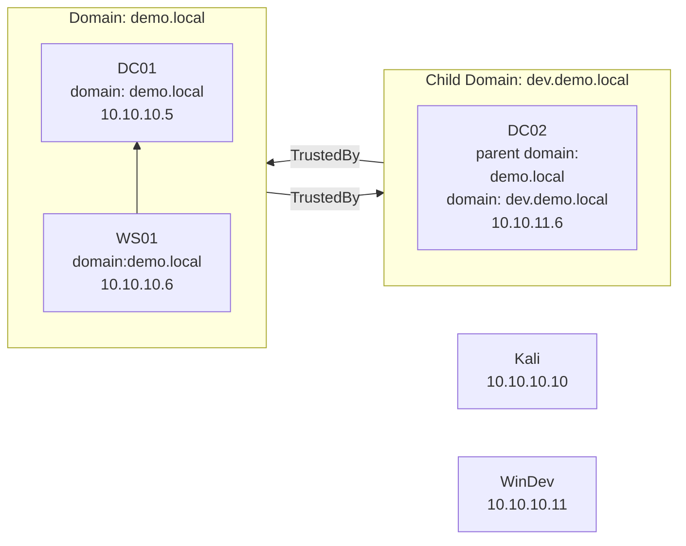

## AD-Lab

Creates a local Active Directory lab in Virtual box. A separate Kali box, and Windows dev machine can also be provisioned.

##  Pre-requisites

This lab requires Vagrant, and either VirtualBox or Vmware to be installed on the host

Running with vmware destop:

```
# 1) Install vmware driver:
https://developer.hashicorp.com/vagrant/downloads/vmware

# 2) Install the vagrant plugin:
vagrant plugin install vagrant-vmware-desktop

# 3) Configure Ansible
ansible-galaxy collection install chocolatey.chocolatey
```

## Setup

There are two stages to the AD-LAB:
1. Create VMs - Create the default virtual machine with no software installed
2. Provision VMs - Install the software onto the virtual machines created in step 1

### Create VMs

The following providers are supported:

1. `virtualbox`
2. `vmware_desktop`

If you are on a Mac and running with vmware, you must first manually create the available network adapters:

```bash
# vmware library
cd /Applications/VMware\ Fusion.app/Contents/Library

# Config for 10.10.0.0/16 and 10.11.0.0/16
config=(
   "VNET_10_DHCP no"
   "VNET_10_HOSTONLY_SUBNET 10.10.0.0"
   "VNET_10_HOSTONLY_NETMASK 255.255.0.0"
   "VNET_10_VIRTUAL_ADAPTER yes"

   "VNET_11_DHCP no"
   "VNET_11_HOSTONLY_SUBNET 10.11.0.0"
   "VNET_11_HOSTONLY_NETMASK 255.255.0.0"
   "VNET_11_VIRTUAL_ADAPTER yes"
)

for line in ${config[@]}; do
   name=$(echo -n $line | cut -d' ' -f1)
   value=$(echo -n $line | cut -d' ' -f2)
   sudo ./vmnet-cfgcli vnetcfgadd "$name" "$value"
done

# Reset
sudo ./vmnet-cli --configure
sudo ./vmnet-cli --stop
sudo ./vmnet-cli --start

# If removal is required
for line in ${config[@]}; do
   name=$(echo -n $line | cut -d' ' -f1)
   sudo ./vmnet-cfgcli vnetcfgremove $name
done
```

Create a single domain controller:

```
vagrant up --debug-timestamp --provider=virtualbox DC01
```

Create Active Directory machines:

```
vagrant up --debug-timestamp --provider=virtualbox DC01 WS01 DC02
```

Create development machines:

```
vagrant up --debug-timestamp --provider=virtualbox Kali WinDev
```

### Provisioning

Ansible is currently used for provisioning.

Create a docker environment for Ansible to run the provisioning scripts from:

```
docker-compose build
docker-compose run ansible
```

Inside the container you can run Ansible commands:

```
time ANSIBLE_CONFIG=$(pwd) ansible-playbook -i inventory --limit Kali kali.yml
time ANSIBLE_CONFIG=$(pwd) ansible-playbook -i inventory --limit WinDev windev.yml -vvv
```

To install additional software such as Chrome/nmap/Wireshark etc on a specific machine such as `DC01`:

```
# Powershell
$env:INSTALL_SOFTWARE = 'true'
vagrant provision DC01
Remove-Item env:INSTALL_SOFTWARE

# Bash
INSTALL_SOFTWARE=true vagrant provision DC01
```

## Lab

The current lab set up is:



### Architectural Decisions

All provisionining logic is designed to be idempotent, i.e. can be run again without causing issues.

Previously standalone Bash/Powershell scripts were used in conjunction with Vagrant's default [shell provisioning](https://developer.hashicorp.com/vagrant/docs/v2.3.3/provisioning/shell). The project was then migrated to use Ansible, which provides basic building blocks such as idempotent wrappers around Git/Choco/etc, that wouldn't need to be re-implemented in bash/powershell.

Chef was not used as it required additional complexity in comparison to Ansible. Window's [Desired State Configuration](https://learn.microsoft.com/en-us/powershell/dsc/overview?view=dsc-2.0) was investigated, but it's not clear if this technology is actively maintained as the latest news is deprecating support for Linux.

### Testing

Currently [Chef's InSpec](https://github.com/inspec/inspec) is used to test the provisioned infrastructure. This test suite connects to the running environments and verifies key components such as user/folders/applications/etc being in the expected state.

```
# Installing and running on Linux with Ruby installed previously
bundle
bundle exec inspec

# Fresh windows installation
. { iwr -useb https://omnitruck.chef.io/install.ps1 } | iex; install -project inspec
inspec
```

Running tests:

```
# DC01
bundle exec inspec exec -t winrm://Administrator@10.10.10.5 --password dc01vagrant ./spec/dc01_spec.rb
# DC02
bundle exec inspec exec -t winrm://Administrator@10.10.10.5 --password dc02vagrant ./spec/dc02_spec.rb
# Kali
bundle exec inspec exec -t ssh://vagrant@10.10.10.10 --password vagrant ./spec/kali_spec.rb
```

When developing inspec tests you can enter into an interactive repl / shell:

```
# Windows DC01 example
bundle inspec shell -t winrm://Administrator@10.10.10.5 --password dc01vagrant

# Kali example
bundle inspec shell -t ssh://vagrant@10.10.10.10 --password vagrant
```

In the interactive inspec shell view all available resources with `help resources`, or view the details about an individual resource with `help file` etc.

Example test run:

```
$ bundle exec inspec exec -t winrm://Administrator@10.10.10.5 --password dc01vagrant ./spec/dc01_spec.rb

Profile:   tests from ./spec/dc01_spec.rb (tests from ..spec.dc01_spec.rb)
Version:   (not specified)
Target:    winrm://Administrator@http://10.10.10.5:5985/wsman:3389
Target ID: 806ac47f-97b0-ec41-9c16-98c790a9473a

  ✔  DC01-Users: User configuration
     ✔  User demo.local\web_admin is expected to exist
     ✔  User demo.local\web_admin groups is expected to eq ["Domain Users", "Administrators"]
     ✔  User demo.local\web_admin maxdays is expected to eq 0
  ✔  DC01-RBCD-Vulnerablility: RBCD Vulnerability
     ✔  User demo.local\sandy is expected to exist
     ✔  User demo.local\sandy groups is expected to eq ["Domain Users"]
     ✔  User demo.local\sandy maxdays is expected to eq 0
     ✔  Powershell stdout is expected to include "ActiveDirectoryRights : GenericWrite"
  ✔  DC01-PasswordExpiration: User password expiration configuration
     ✔  [] length is expected to eq 0
  ✔  DC01-DNS: DNS configuration
     ✔  Host dc01.demo.local is expected to be reachable
     ✔  Host dc01.demo.local is expected to be resolvable
     ✔  Host dc01.demo.local ipaddress is expected to include "10.10.10.5"
     ✔  Host dc02.dev.demo.local ipaddress is expected to be nil
```

### Timing

```powershell
Measure-Command { vagrant up | Out-Default }
```

### Useful commands

- `vagrant init <box-name>` - Create a new vagrant file set to use the provided box-name
- `vagrant status` - Display the state of the vagrant environment in the current directory
- `vagrant up` - Creates and configures your Vagrant environment as defined in your Vagrant file
- `vagrant halt` - Shuts down any running virtual machines
- `vagrant validate` - Validate the Vagrantfile
- `vagrant reload` - Reload the VM; the equivalent of running a halt followed by an up. Provisioners will not run by default
- `vagrant destroy` - Destroys the VMs
- `vagrant plugin list` - View currently installed vagran plugins
- `vagrant plugin install vagrant-vbguest` - Install plugin to automatically install the host's VirtualBox Guest Additions on the guest system
- `vagrant plugin uninstall vagrant-vbguest` - Uninstall the vbguest plugin

powershell.exe -file .\dc02-01-install-forest.ps1 -parentDomain demo.local -parentDomainIp 10.10.10.5 -domain dev.demo.local -domainIp 10.10.10.6 -administratorPassword vagrant
