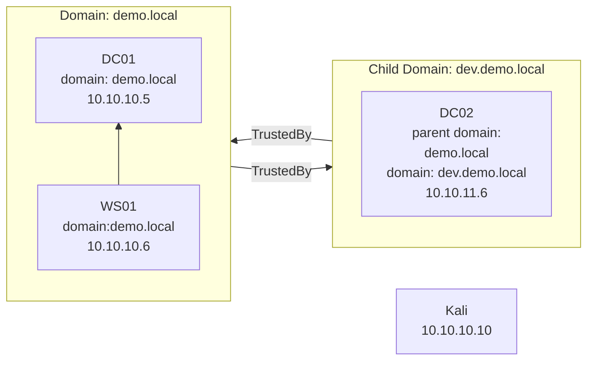

## AD-Lab

Bringing a single domain controller up:

```
vagrant up --provider=virtualbox DC01
```

Bringing all machines up:

```
vagrant up --provider=virtualbox DC01 WS01 DC02 Kali
```

At this time only Virtualbox is supported

## Lab

The current lab set up is:



### Architecture Decisions

All Powershell scripts are designed to be idempotent, i.e. they can be run again without causing issues.

For simplicitly the setup scripts do not use Ansible or Chef. Window's [Desired State Configuration](https://learn.microsoft.com/en-us/powershell/dsc/overview?view=dsc-2.0) was investigated, but it's not clear if this technology is actively maintained as the latest news is deprecating support for Linux.

### Testing

Using inspec

### Timing

```powershell
Measure-Command { vagrant up | Out-Default }
```

### Useful commands

- `vagrant init <box-name>` - Create a new vagrant file set to use the provided box-name
- `vagrant status` - Display the state of the vagrant environment in the current directory
- `vagrant up` - Creates and configures your Vagrant environment as defined in your Vagrant file
- `vagrant halt` - Shuts down any running virtual machines
- `vagrant validate` - Validate the Vagrantfile
- `vagrant reload` - Reload the VM; the equivalent of running a halt followed by an up. Provisioners will not run by default
- `vagrant destroy` - Destroys the VMs
- `vagrant plugin list` - View currently installed vagran plugins
- `vagrant plugin install vagrant-vbguest` - Install plugin to automatically install the host's VirtualBox Guest Additions on the guest system
- `vagrant plugin uninstall vagrant-vbguest` - Uninstall the vbguest plugin

powershell.exe -file .\dc02-01-install-forest.ps1 -parentDomain demo.local -parentDomainIp 10.10.10.5 -domain dev.demo.local -domainIp 10.10.10.6 -administratorPassword vagrant
