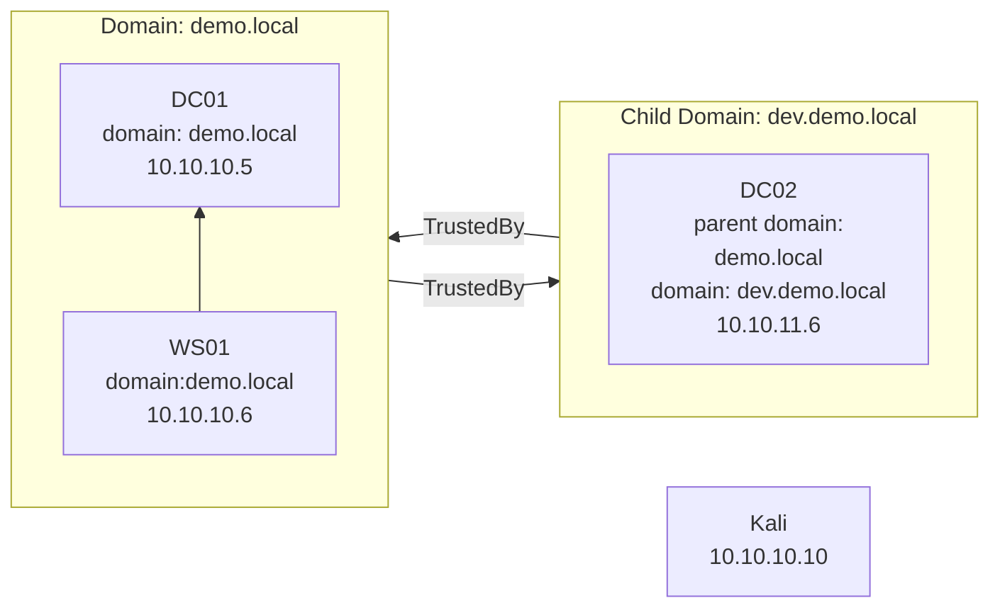

## AD-Lab

Bringing a single domain controller up:

```
vagrant up --provider=virtualbox DC01
```

Bringing all machines up:

```
vagrant up --provider=virtualbox DC01 WS01 DC02 Kali
```

At this time only Virtualbox is supported

To install additional software such as Chrome/nmap/Wireshark etc:

```
# Powershell
$env:INSTALL_SOFTWARE = 'true'
vagrant provision DC01
Remove-Item env:INSTALL_SOFTWARE

# Bash
INSTALL_SOFTWARE=true vagrant provision DC01
```

## Lab

The current lab set up is:



### Architecture Decisions

All Powershell scripts are designed to be idempotent, i.e. they can be run again without causing issues.

For simplicitly the setup scripts do not use Ansible or Chef. Window's [Desired State Configuration](https://learn.microsoft.com/en-us/powershell/dsc/overview?view=dsc-2.0) was investigated, but it's not clear if this technology is actively maintained as the latest news is deprecating support for Linux.

### Testing

Currently [Chef's InSpec](https://github.com/inspec/inspec) is used to test the provisioned infrastructure. This test suite connects to the running environments and verifies key components such as user/folders/applications/etc being in the expected state.

```
# Installing and running on Linux with Ruby installed previously
bundle
bundle exec inspec

# Fresh windows installation
. { iwr -useb https://omnitruck.chef.io/install.ps1 } | iex; install -project inspec
inspec
```

Running tests:

```
# DC01
bundle exec inspec exec -t winrm://Administrator@10.10.10.5 --password dc01vagrant ./spec/dc01_spec.rb
# DC02
bundle exec inspec exec -t winrm://Administrator@10.10.10.5 --password dc02vagrant ./spec/dc02_spec.rb
# Kali
bundle exec inspec exec -t ssh://vagrant@10.10.10.10 --password vagrant ./spec/kali_spec.rb
```

When developing inspec tests you can enter into an interactive repl / shell:

```
# Windows DC01 example
bundle inspec shell -t winrm://Administrator@10.10.10.5 --password dc01vagrant

# Kali example
bundle inspec shell -t ssh://vagrant@10.10.10.10 --password vagrant
```

In the interactive inspec shell view all available resources with `help resources`, or view the details about an individual resource with `help file` etc.

Example test run:

```
$ bundle exec inspec exec -t winrm://Administrator@10.10.10.5 --password dc01vagrant ./spec/dc01_spec.rb

Profile:   tests from ./spec/dc01_spec.rb (tests from ..spec.dc01_spec.rb)
Version:   (not specified)
Target:    winrm://Administrator@http://10.10.10.5:5985/wsman:3389
Target ID: 806ac47f-97b0-ec41-9c16-98c790a9473a

  ✔  DC01-Users: User configuration
     ✔  User demo.local\web_admin is expected to exist
     ✔  User demo.local\web_admin groups is expected to eq ["Domain Users", "Administrators"]
     ✔  User demo.local\web_admin maxdays is expected to eq 0
  ✔  DC01-RBCD-Vulnerablility: RBCD Vulnerability
     ✔  User demo.local\sandy is expected to exist
     ✔  User demo.local\sandy groups is expected to eq ["Domain Users"]
     ✔  User demo.local\sandy maxdays is expected to eq 0
     ✔  Powershell stdout is expected to include "ActiveDirectoryRights : GenericWrite"
  ✔  DC01-PasswordExpiration: User password expiration configuration
     ✔  [] length is expected to eq 0
  ✔  DC01-DNS: DNS configuration
     ✔  Host dc01.demo.local is expected to be reachable
     ✔  Host dc01.demo.local is expected to be resolvable
     ✔  Host dc01.demo.local ipaddress is expected to include "10.10.10.5"
     ✔  Host dc02.dev.demo.local ipaddress is expected to be nil
```

### Timing

```powershell
Measure-Command { vagrant up | Out-Default }
```

### Useful commands

- `vagrant init <box-name>` - Create a new vagrant file set to use the provided box-name
- `vagrant status` - Display the state of the vagrant environment in the current directory
- `vagrant up` - Creates and configures your Vagrant environment as defined in your Vagrant file
- `vagrant halt` - Shuts down any running virtual machines
- `vagrant validate` - Validate the Vagrantfile
- `vagrant reload` - Reload the VM; the equivalent of running a halt followed by an up. Provisioners will not run by default
- `vagrant destroy` - Destroys the VMs
- `vagrant plugin list` - View currently installed vagran plugins
- `vagrant plugin install vagrant-vbguest` - Install plugin to automatically install the host's VirtualBox Guest Additions on the guest system
- `vagrant plugin uninstall vagrant-vbguest` - Uninstall the vbguest plugin

powershell.exe -file .\dc02-01-install-forest.ps1 -parentDomain demo.local -parentDomainIp 10.10.10.5 -domain dev.demo.local -domainIp 10.10.10.6 -administratorPassword vagrant
